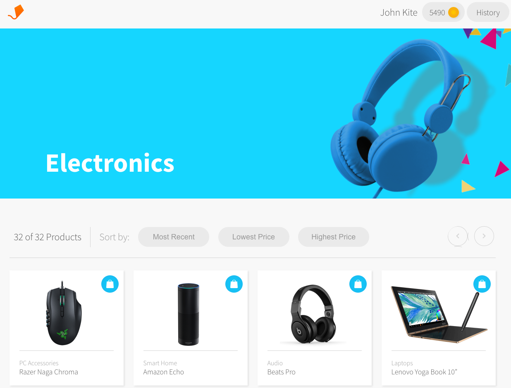

# [MOCK] Rewards Store Front


Webpage created to mock a reward storefront: you will be able to redeem products, add coins and view purchase history.

The page is deployed here:

https://r-vasquez.github.io/React_mock_rewards_store/

## About this proyect

This is part of a React Course and uses this [Aerolab API](https://aerolabchallenge.docs.apiary.io/) to retrieve the data of the products and the end user. The intention of this UI is to look like [this figma file](https://www.figma.com/file/gjWyRFmqzh5BncKcM9BHfE/coding-challenge)

## How to run locally

Clone the project, install node_modules (using npm install) and run

```bash
yarn start
```

## How to deploy

After cloning and installing dependencies, run

```bash
npm run deploy
```

In case you want to change your deployment page make sure you change the "homepage" property in the package.json file

## Stack Used

- React (React Hooks)
- Pure CSS (No libraries/frameworks)
- Github Pages to deploy
- Project was bootstrapped with Create React App
